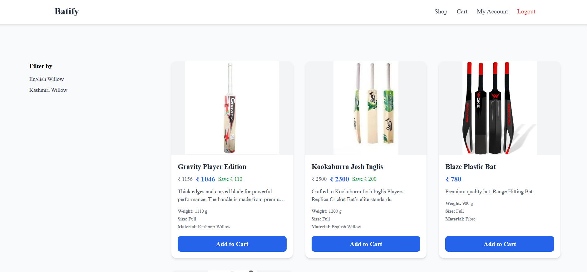
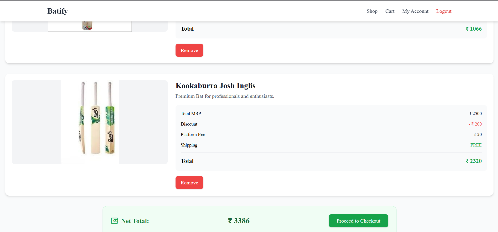
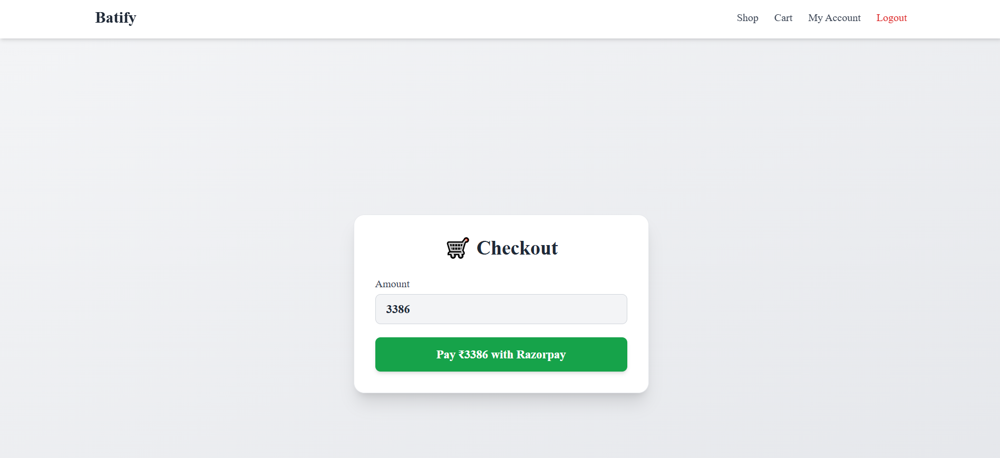
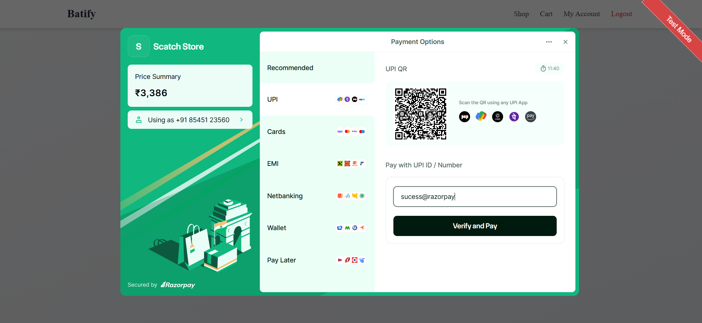
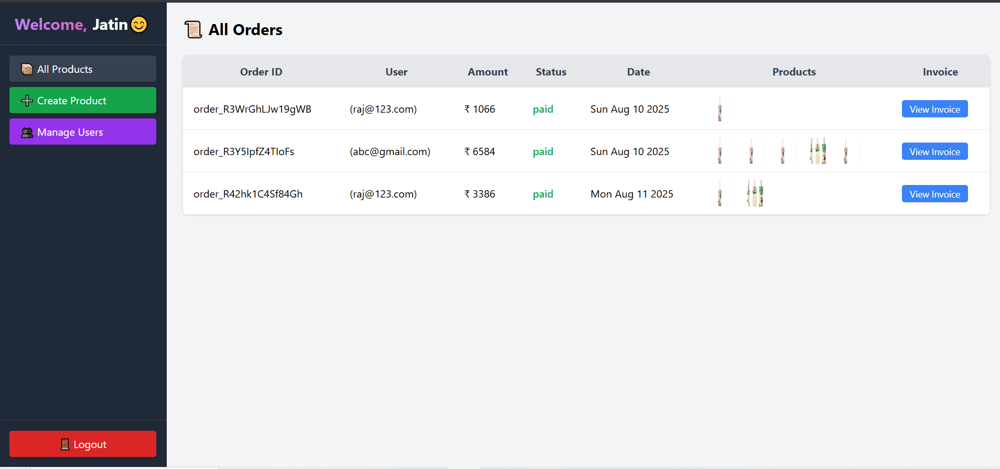
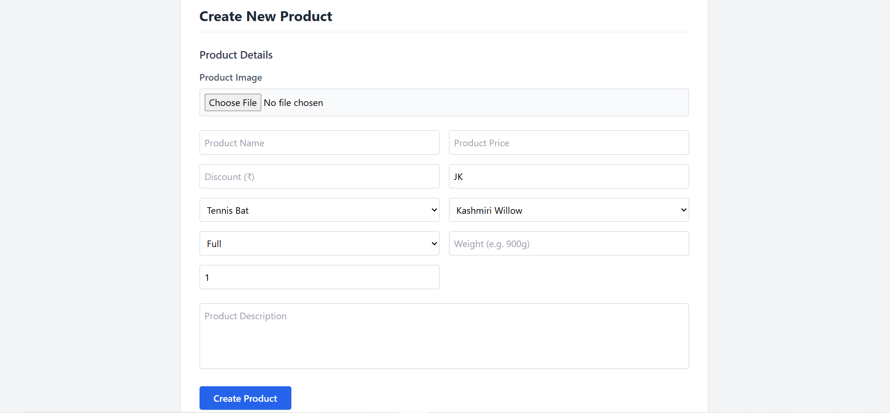
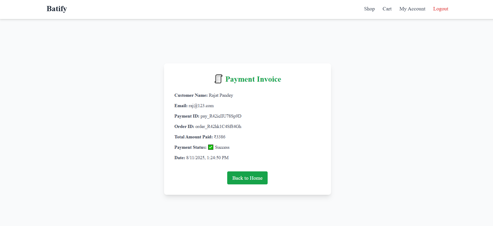

Got it ✅
I’ll prepare a **professional, detailed `README.md`** for your **Batify** project that you can directly put in your GitHub repo.
It will be **developer-friendly**, have **clear installation steps**, **screenshots placeholders**, and make it **look like a polished production-ready project**.

---

```markdown
# 🏏 Batify - Cricket Bat E-Commerce Platform

**Batify** is a **full-stack e-commerce web application** built using the **MERN stack** with **Razorpay payment integration**.  
It is designed exclusively for selling cricket bats, featuring **secure authentication**, **admin management**, and a **smooth checkout process**.

---

## 🚀 Features

### 👤 User Module
- User registration and login with **bcrypt password hashing**.
- JWT-based authentication & session management.
- Browse bats, view product details, and add to cart.
- Checkout with **Razorpay payment gateway**.
- View past orders and download invoices.

### 🛒 Product Module
- Product listing with images, price, and description.
- Dynamic product storage in MongoDB with image buffers.
- Admin can create, update, and delete products.

### 🛠 Admin Panel
- **Super Admin** creation via script (`createAdmin.js`).
- Manage all products and users.
- View all orders with payment details and product thumbnails.
- Generate & view invoices.

### 💳 Payment Integration
- Integrated **Razorpay API** for secure transactions.
- Order creation, verification, and transaction logging.
- Auto-generated invoices.

---

## 🏗 Tech Stack

**Frontend:** HTML, CSS, TailwindCSS, EJS  
**Backend:** Node.js, Express.js  
**Database:** MongoDB (Mongoose ODM)  
**Payment Gateway:** Razorpay  
**Authentication:** JWT, bcrypt  
**Validation:** Joi  
**Hosting:** Render (Backend), MongoDB Atlas (DB)

---

## 📂 Project Structure
```

Batify/
│
├── config/               # Database and Razorpay config
├── models/               # Mongoose models (User, Product, Order)
├── public/               # Static assets (CSS, JS, images)
├── routes/               # Express routes for users, owners, products, payment
├── views/                # EJS templates
├── createAdmin.js        # Script to create super admin
├── app.js                # Main Express app
└── package.json

````

---

## ⚙️ Installation & Setup

### 1️⃣ Clone the repository
```bash
git clone https://github.com/Jatin3979/Batify.git
cd Batify
````

### 2️⃣ Install dependencies

```bash
npm install
```

### 3️⃣ Create `.env` file

```env
MONGODB_URI=your_mongodb_atlas_connection_string
EXPRESS_SESSION_SECRET=your_session_secret
JWT_SECRET=your_jwt_secret
RAZORPAY_KEY_ID=your_razorpay_key_id
RAZORPAY_KEY_SECRET=your_razorpay_key_secret
```

### 4️⃣ Run the server

```bash
npm start
```

Server will start at `http://localhost:3000`

### 5️⃣ Create Super Admin

```bash
node createAdmin.js
```

---

## 📸 Screenshots

### 🛒 User Side
1. **Shop Page** – Browse bats with filters and responsive grid layout.  
   

2. **Product Details Page** – Detailed view with price, discount, material, and add-to-cart option.  
   

3. **Cart Page** – View selected bats, total price, and proceed to checkout.  
   

4. **Razorpay Checkout** – Secure payment gateway for order processing.  
   
   

---

### 🛠️ Admin Side
5. **Admin Dashboard** – Manage products, view orders, and control the store.  
   

6. **Create Product Page** – Add new bats with name, price, material, and image upload.  
   
   

7. **Invoice View** – Invoice for completed orders.  
   


## 🔗 Live Demo

* **Frontend + Backend:** [Batify on Render](https://batify.onrender.com)

---

## 👨‍💻 Author

**Jatin Kumar**

* [GitHub](https://github.com/Jatin3979)
* [LinkedIn](https://www.linkedin.com/in/jatin-kumar-1560152a7)
* [LeetCode](https://leetcode.com/u/jatinkumar3979/)

